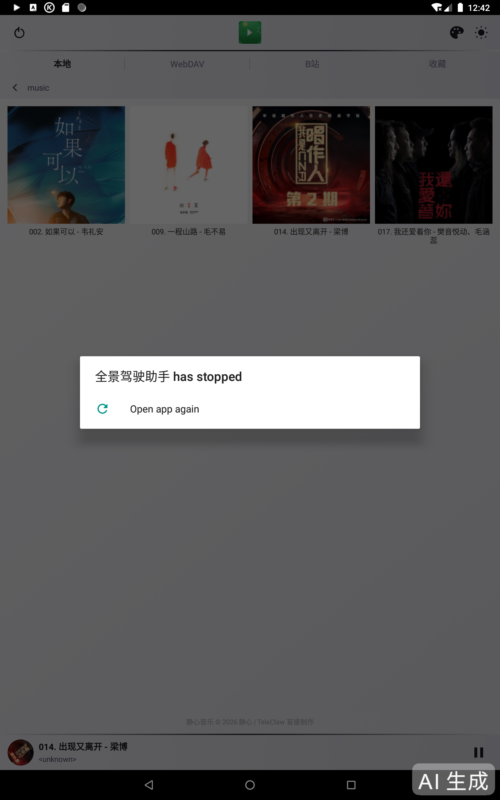
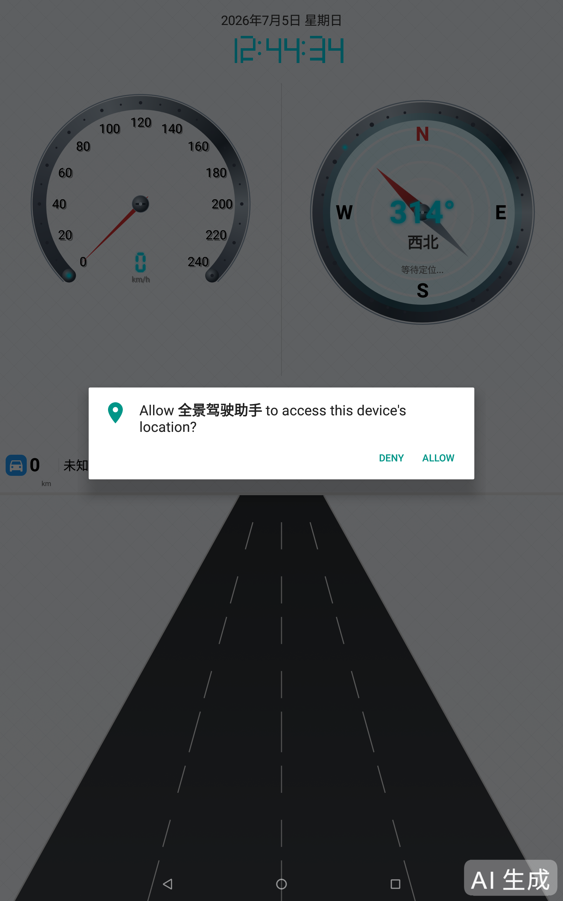
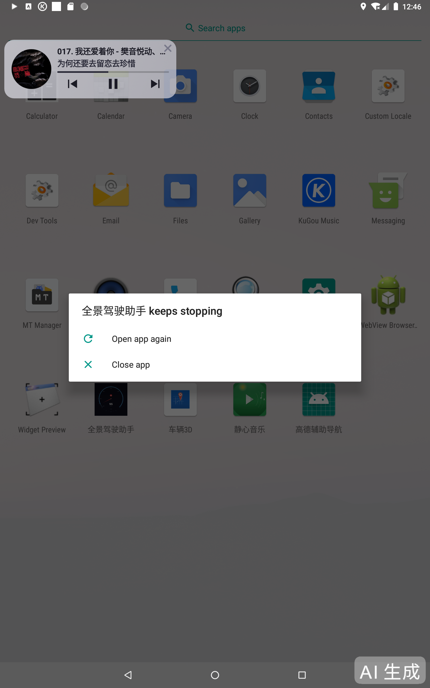

---
AIGC:
  ContentProducer: '001191110102MAD55U9H0F10002'
  ContentPropagator: '001191110102MAD55U9H0F10002'
  Label: '1'
  ProduceID: 'd737bfc9-3216-4714-b5cd-c9c96e8c25d1'
  PropagateID: 'd737bfc9-3216-4714-b5cd-c9c96e8c25d1'
  ReservedCode1: '8faab8a4-b6a7-4929-a1a6-dcda103b3c67'
  ReservedCode2: '8faab8a4-b6a7-4929-a1a6-dcda103b3c67'
---

<div align="center">

# 乐酷驾驶 · LecoDrive

**面向安卓车机的全景驾驶仪表盘应用**
**A Panoramic Driving Dashboard for Android IVI Systems**

3D 车模 · 速度仪表 · 导航广播 · 指南车 · 天气 · 壁纸 · 里程油耗
3D Car Model · Speedometer · Navi Broadcast · Compass · Weather · Wallpaper · Mileage & Fuel

</div>

---

## 📸 截图 · Screenshots

<div align="center">
<table>
  <tr>
    <td align="center"><br/><sub>日间主界面 · Day Mode</sub></td>
    <td align="center"><br/><sub>3D 车模渲染 · 3D Car Model</sub></td>
    <td align="center"><br/><sub>夜间主界面 · Night Mode</sub></td>
  </tr>
</table>
</div>

---

## 📖 项目简介 · Overview

**乐酷驾驶**是一款为安卓车机（IVI）打造的全景驾驶仪表盘应用。它通过 **OpenGL ES 2.0 自研引擎**渲染 Drako 压缩的 GLB 格式 3D 车辆模型，结合 **270° 弧形 LED 速度仪表**、**高德车机版导航广播**、**GPS 指南车**、**实时天气系统**与**动态壁纸**，把行车信息与科幻金属风格的视觉表现融为一体，打造沉浸式驾驶体验。

**LecoDrive** is a panoramic driving dashboard built for Android in-vehicle infotainment (IVI) systems. It renders Draco-compressed GLB 3D car models via a **custom OpenGL ES 2.0 engine**, combined with a **270° arc LED speedometer**, **Amap Auto navigation broadcast**, **GPS compass**, **real-time weather system** and **dynamic wallpapers**, blending driving information with a sci-fi metallic visual style for an immersive driving experience.

> ⚠️ **运行前置 · Prerequisite**: 本应用需配合「乐酷桌面」（包名 `com.lecoauto`）作为车机启动器，未安装时会提示并退出。
> This app requires **Leku Launcher** (`com.lecoauto`) to be installed as the car launcher; it prompts and exits if absent.

---

## ✨ 核心功能 · Key Features

### 🚗 一、3D 车辆模型渲染 · 3D Vehicle Rendering

自研 OpenGL ES 2.0 渲染引擎，零第三方 3D 库依赖，支持复杂 GLB 模型加载与渲染。

Custom OpenGL ES 2.0 engine with zero third-party 3D library dependencies, supporting complex GLB model loading and rendering.

| 功能点 · Feature | 描述 · Description |
|---|---|
| **Draco JNI 解码** · Draco JNI decoding | 集成 Draco 原生解码库，支持多 mesh Draco 压缩的 GLB 模型 |
| **自动归一化缩放** · Auto normalization | 根据模型包围盒自动计算缩放系数，任意大小模型在默认状态下均约 3 单位宽 |
| **语义颜色缓存** · Semantic color cache | 按节点名称着色（车体银白、车窗蓝色、轮胎黑色等 20+ 语义色），首次计算后缓存到 DrawUnit，避免每帧重复计算 |
| **双渲染模式** · Dual render modes | Batch 模式面向无纹理模型，Single-buffer 模式面向有纹理模型，节点变换累积确保部件位置正确 |
| **纹理资源管理** · Texture management | 切换模型时自动释放旧纹理，避免 GPU 内存泄漏 |
| **异步加载** · Async loading | 后台线程解析 GLB，GL 线程上传纹理，不阻塞渲染主循环 |
| **朝向自动检测** · Auto orientation | 根据模型最长轴设置默认视角，部分车型特殊旋转 180° |
| **内置默认车模** · Built-in default model | 内置柯尼塞格 Regera 模型（`assets/default_car.glb`），开箱即用 |

### 🎛️ 二、速度仪表盘 · Speedometer

270° 弧形表盘 + LED 风格，科幻金属质感。

270° arc dial with LED styling and sci-fi metallic texture.

- **270° 弧形表盘** · 270° arc dial — 金属渐变外圈 + 中心螺丝帽装饰
- **LED 刻度点** · LED scale points — 全周 LED 发光刻度，青色发光元素
- **LED 七段数码管数字** · LED 7-segment display — 速度数值以数码管字体呈现
- **超速红色预警** · Overspeed red warning — 超过阈值时表盘变红预警
- **渐变指针** · Gradient pointer — 科幻光感指针

### 🧭 三、指南针时钟 · Compass Clock

基于 GPS bearing 的方向指示 + 时钟复合显示，LED 七段数码管风格。

GPS bearing-based direction indicator combined with clock display, in LED 7-segment style.

### 🗺️ 四、导航系统 · Navigation System

通过接收**高德车机版导航广播**实时解析导航指令，无需自身集成 SDK。

Receives **Amap Auto navigation broadcasts** in real time to parse navigation instructions — no SDK integration needed.

- **高德广播数据解析** · Amap broadcast parsing — 解析转向、距离、车道、道路名等结构化数据
- **转向图标映射** · Turn icon mapping — 53 个内置 navi 图标，覆盖全部 iconId：
  - 左转 / 右转 / 左前方 / 右前方 / 调头
  - 左侧偏转 +30°、右侧偏转 -30°、左前方 +15°、右前方 -15°
  - 调头 ±180°、新增 65 号 +10°、66 号 -10°
- **转向灯逻辑** · Turn signal logic — 导航或巡航偏转时对应侧车灯琥珀色闪烁（500ms 周期），调头时双闪
- **刹车灯逻辑** · Brake light logic — GPS 速度短时快速下降（>8km/h）时两侧后灯红色常亮，松刹车后延时 1 秒熄灭
- **前台服务保活** · Foreground service — `PanDriveService` 在画中画/窗口模式下仍能稳定接收广播

### 🌦️ 五、天气系统 · Weather System

免费 API（无需 key）+ 内置天气视频，多维度气象信息可视化。

Free API (no key required) + built-in weather videos for multi-dimensional meteorological visualization.

- **Open-Meteo API** — 免费无 key，GPS 坐标触发，30 分钟轮询
- **WMO 代码映射** · WMO code mapping — 6 种天气状态：
  - sunny(0,1) / cloud(2,3) / fog(45,48)
  - rain(51-57, 61-67, 80-82, 95-99)
  - snow(71-77, 85, 86)
  - wind(wind_speed>40km/h AND code 0-3)
- **天气显示** · Weather display — 温度 + 状态（左下大字+小字）、风向风速（左车道竖排旋转）、湿度（右车道竖排旋转）
- **昼夜自适应配色** · Day/night adaptive — 白天黑色半透明、夜间白色半透明，轻微晃动动画
- **6 个内置天气视频** · 6 built-in videos — sunny / cloud / rain / snow / fog / wind，首次启动自动复制到设备存储
- **天气动画与壁纸互斥** · Mutually exclusive with wallpaper — 开启天气动画后自动切换天气视频
- **IP 定位兜底** · IP geolocation fallback — GPS 坐标为 0,0 时通过 ip-api.com 获取大致经纬度，5 分钟限频

### 🖼️ 六、壁纸系统 · Wallpaper System

支持图片与视频壁纸，日夜独立配置，center-crop 自适应渲染。

Supports both image and video wallpapers, independent day/night configuration, center-crop adaptive rendering.

- **图片壁纸** · Image wallpaper — `BitmapFactory` 解码 + center-crop 绘制，支持 jpg/png/webp
- **视频壁纸** · Video wallpaper — `SurfaceView` + `MediaPlayer` + center-crop 缩放，支持 mp4/3gp/webm
- **日夜双壁纸** · Day & night — 白天/夜间独立壁纸配置，一键切换
- **壁纸遮罩** · Wallpaper mask — 半透明黑色叠加，日间 0x44、夜间 0x88，无壁纸时回退渐变背景
- **大图采样降缩** · Large image sampling — 循环计算 2 的幂次采样率，避免大图 OOM
- **四按钮设置页** · 4-button settings — 白天 / 夜间 / 天气 / 默认，一键管理
- **内置默认壁纸** · Built-in default — `day.webp` + `night.webp`，开箱即用
- **应用内文件浏览器** · In-app file browser — 替代系统文件选择器，兼容车机窗口模式

### 📊 七、里程与油耗 · Mileage & Fuel

LED 七段数码管风格，两行布局（标签 + 数字），4 秒循环切换，滑动动画。

LED 7-segment style, two-row layout (label + number), 4-second cyclic switching with slide animation.

- **实时里程** · Realtime mileage — 单次启动清零
- **今日里程** · Today's mileage — 跨天自动清零
- **累计里程** · Total mileage — GPS 累加 + 用户可配置存量里程（设置存量里程时自动清零 totalDistance 避免重复计算）
- **油耗估算** · Fuel estimation — 速度区间映射油耗表，20 秒采样，3 点移动平均，60 秒刷新 UI
- **里程计算算法** · Mileage algorithm — GPS Haversine 公式累加，过滤低精度点（accuracy>20m）和静止点（speed<2km/h）

### 🎢 八、巡航与演示动画 · Cruise & Demo Animation

- **巡航模式转向** · Cruise steering — GPS bearing 变化率驱动车头偏转（阈值 5°/s，放大 2.5 倍，最大 ±30°），车速 <5km/h 时不响应
- **演示动画系统** · Demo animation — 每 10 分钟周期随机播放 4 种动画（放大还原 / 缩小还原 / 旋转展示 / 侧面旋转），动画间隔至少 1 分钟，行驶过程中自动演示

### 🔄 九、模型管理 · Model Management

- **自动记忆** · Auto memory — 启动时加载上次使用的 GLB 模型，文件不存在时才随机选择
- **单击切换** · Tap to switch — 单击导航区域随机切换模型，排除当前和加载失败的模型，500ms 防抖
- **自动搜索下载目录** · Auto search — 系统 API → 常见车机路径 → 外部存储根目录，优先 `1.glb`→`10.glb`，其次按体积最大的 `.glb`
- **错误处理** · Error handling — 解析失败的模型记录路径不再重试，连续失败最多 5 次后自动切换下一个

### 🪟 十、窗口模式 & 兼容性 · Window Mode & Compatibility

- **多窗口/分屏支持** · Multi-window / split-screen support
- **configChanges 声明** — 所有 Activity 声明 `orientation|keyboardHidden|screenSize|smallestScreenSize|screenLayout` + `resizeableActivity="true"`
- **CLEAR_TOP 清栈方案** · CLEAR_TOP stack-clearing — 文件选择完成后直接 `startActivity(MainActivity, CLEAR_TOP) + finish()`，规避车机 Activity 重建问题
- **STATUS_BAR 避让** · Status bar avoidance — 通过 `WindowInsets` 动态调整顶栏与按钮 margin
- **广播 setPackage** · Broadcast setPackage — 解决 Android 16 同应用广播丢弃问题
- **ACTION_GET_CONTENT** — 替代 `ACTION_OPEN_DOCUMENT`，兼容车机系统

---

## 🏗️ 技术架构 · Technical Architecture

### 布局比例 · Layout Proportions

```
┌─────────────────────────────────────────────┐
│         日期时间 · DateTime (10%)            │
├─────────────────────────────────────────────┤
│                                             │
│   仪表盘 + 指南针时钟 (45%)                  │
│   Speedometer + Compass Clock               │
│                                             │
├──────────────────────────┬──────────────────┤
│   导航 (15%)              │                  │
│   Navigation              │  3D 车道线 (30%) │
│                          │  3D Car / Lane    │
└──────────────────────────┴──────────────────┘
```

### 技术栈 · Tech Stack

| 方面 · Aspect | 选型 · Choice |
|---|---|
| **语言** · Language | Java 1.8 |
| **构建** · Build | Gradle (Android Gradle Plugin) |
| **最低 SDK** · minSdk | 21 (Android 5.0 Lollipop) |
| **目标 SDK** · targetSdk | 35 (Android 15) |
| **编译 SDK** · compileSdk | 35 |
| **3D 渲染** · 3D rendering | OpenGL ES 2.0 (自研引擎 · custom engine) |
| **模型解码** · Model decoding | Draco JNI (原生库 · native libs) |
| **模型格式** · Model format | GLB (二进制 glTF) |
| **第三方依赖** · Third-party deps | **零依赖 · Zero dependencies** |
| **代码混淆** · Obfuscation | R8 / ProGuard (minify + shrinkResources) |

### 视觉风格 · Visual Style

- 统一**科幻金属风格** — metallic sci-fi
- LED 发光元素（青色 / 绿色）— LED glow (cyan/green)
- 超速红色预警 — overspeed red warning
- 270° 弧形表盘 + LED 刻度点 + LED 七段数码管数字
- 金属渐变外圈 + 中心螺丝帽装饰

---

## 📁 项目结构 · Project Structure

```
app/src/main/
├── java/com/jingxin/pandrive/
│   ├── MainActivity.java          # 主界面 · Main UI
│   ├── SettingsActivity.java      # 设置页 · Settings (4-button layout)
│   ├── FilePickerActivity.java    # 应用内文件选择 · In-app file picker
│   ├── PanDriveService.java       # 前台服务(导航广播) · Fg service
│   ├── PanDriveApp.java           # Application
│   ├── gl/
│   │   ├── Car3DRenderer.java     # 3D 渲染器 · GL renderer (GLB+Draco)
│   │   └── GlbParser.java         # GLB 解析器 · GLB parser
│   ├── view/
│   │   ├── SpeedometerView.java   # 速度仪表盘 (1288 行)
│   │   ├── CompassView.java       # 指南针时钟
│   │   ├── NavigationBarView.java # 导航栏 (847 行, 53 图标)
│   │   ├── LaneView.java          # 车道线渐变背景
│   │   └── GridBackgroundView.java# 网格背景 + 壁纸 + 天气文字
│   └── data/
│       └── WeatherHelper.java     # 天气数据 (Open-Meteo + ip-api)
├── assets/
│   ├── default_car.glb            # 内置柯尼塞格车模 (2.3 MB)
│   ├── default_wallpaper/         # 内置默认壁纸 (day/night.webp)
│   └── pandrive_weather/          # 6 个内置天气视频 (8.3 MB)
├── res/
│   ├── drawable-nodpi/            # 53 个 navi 转向图标 + 其他资源
│   ├── layout/                    # 布局
│   └── xml/network_security_config.xml  # HTTP 明文配置 (ip-api)
└── AndroidManifest.xml
```

---

## 🔧 构建与运行 · Build & Run

### 环境要求 · Prerequisites

- Android Studio (推荐 · recommended)
- JDK 17 (Android Studio 内置 · bundled)
- Android SDK 35

### 构建步骤 · Build Steps

```bash
# 1. 克隆仓库 · Clone
git clone https://github.com/ddjinxin/LecoDrive.git
cd LecoDrive

# 2. 配置签名 · Configure signing
#    在项目根目录创建 local.properties 并填入密钥信息：
cat > local.properties << 'EOF'
sdk.dir=/path/to/Android/Sdk
STORE_PASSWORD=your_keystore_password
KEY_PASSWORD=your_key_password
EOF

#    将签名密钥放到 app/gaoden_release.jks
#    Place your keystore at app/gaoden_release.jks

# 3. 编译 Release APK · Build release
export JAVA_HOME="/path/to/Android Studio.app/Contents/jbr/Contents/Home"
export ANDROID_HOME="/path/to/Android/Sdk"
./gradlew assembleRelease

# 4. 产物路径 · Output
#    app/build/outputs/apk/release/app-release.apk
```

### 安装 · Install

```bash
adb install -r app/build/outputs/apk/release/app-release.apk
```

> ⚠️ **运行前置 · Prerequisite**：需先安装「乐酷桌面」（`com.lecoauto`）作为车机启动器。
> Requires Leku Launcher (`com.lecoauto`) installed as the car launcher.

---

## 📂 资源放置说明 · Resource Placement

应用安装后，将以下文件放到设备的 **Download 目录**（应用会自动搜索常见路径，包括 `/sdcard/Download`、`/storage/emulated/0/Download` 等）即可生效：

After installation, place files in the device's **Download directory** (auto-searched across common paths) to take effect:

| 资源 · Resource | 路径 · Path | 用途 · Usage |
|---|---|---|
| **GLB 车模** · GLB car models | `/sdcard/Download/*.glb` | 3D 车辆模型（点击导航区随机切换）|
| **壁纸** · Wallpapers | `/sdcard/Download/pandrive_wallpaper/day.*`<br/>`/sdcard/Download/pandrive_wallpaper/night.*` | 日间/夜间壁纸（jpg/png/webp/mp4）|
| **天气视频** · Weather videos | `/sdcard/Download/pandrive_weather/` | 自定义天气视频（sunny/cloud/rain/snow/fog/wind.mp4）|

> 💡 **提示 · Tip**：天气视频与默认壁纸已内置到 assets，首次启动自动复制到设备存储，无需手动放置。
> Weather videos and default wallpapers are bundled in assets and auto-copied on first launch.

---

## 📱 兼容性 · Compatibility

- **最低 Android 5.0 (API 21)** — 广泛兼容老旧车机
- **目标 Android 15 (API 35)** — 符合最新平台规范
- **多窗口 / 分屏** — 兼容车机常驻窗口模式
- **测试设备** · Tested on:
  - 华为手机 · Huawei phone
  - 红米手机 · Redmi phone
  - Android 13 模拟器 · Android 13 emulator
  - Android 5.1 模拟器 · Android 5.1 emulator
  - Freescale MEK-MX8Q 车机 HMI (Android 8.1, API 27)

---

## 🌐 依赖的外部服务 · External Services

| 服务 · Service | 用途 · Purpose | 鉴权 · Auth | 项目地址 · Link |
|---|---|---|---|
| **Open-Meteo** | 天气数据 · Weather data | 免费 · Free, 无 key | https://open-meteo.com |
| **ip-api.com** | IP 地理定位兜底 · IP geolocation fallback | 免费 · Free, 1500次/天 | https://ip-api.com |
| **高德车机版** · Amap Auto | 导航广播源 · Navigation broadcast source | 需独立安装 · Separate install | - |
| **乐酷桌面** · Leku Launcher | 车机启动器 · Car launcher | 需独立安装 · Separate install | - |

---

## 📋 权限说明 · Permissions

| 权限 · Permission | 用途 · Usage |
|---|---|
| `INTERNET` / `ACCESS_NETWORK_STATE` | 天气 API 与 IP 定位 · Weather API & IP geolocation |
| `SYSTEM_ALERT_WINDOW` | 悬浮显示 · Floating features |
| `FOREGROUND_SERVICE` / `FOREGROUND_SERVICE_MEDIA_PLAYBACK` | 前台服务保活 · Foreground service keep-alive |
| `ACCESS_FINE_LOCATION` / `ACCESS_COARSE_LOCATION` | GPS 指南车与里程 · GPS compass & mileage |
| `POST_NOTIFICATIONS` | Android 13+ 通知 · Notifications on Android 13+ |
| `READ/WRITE_EXTERNAL_STORAGE` / `MANAGE_EXTERNAL_STORAGE` | 读取 GLB 模型与壁纸 · Read GLB models & wallpapers |

---

## ⚠️ 已知问题 · Known Issues

- **全屏 ↔ 窗口模式切换时应用卡死** — 在某些车机系统（Android 8.1 多窗口）上，切换模式时 Activity 重建后画面不刷新。根因可能在 GL context/Surface/TextureView 重建层，**修复中**。
  - **App freezes on fullscreen ↔ window mode switch** — On some IVI systems (Android 8.1 multi-window), the activity rebuilds but rendering stalls. Root cause may be in GL context/Surface/TextureView rebuild. **Under investigation.**

---

## 📜 开源协议 · License

本项目仅供学习交流使用。如需商用请联系作者。
This project is for learning and communication purposes only. Contact the author for commercial use.

---

## 🙏 致谢 · Acknowledgements

- [Open-Meteo](https://open-meteo.com) — 免费天气 API · free weather API
- [ip-api.com](https://ip-api.com) — 免费 IP 定位 · free IP geolocation
- [Khronos glTF](https://www.khronos.org/gltf/) — GLB 模型格式标准 · GLB model format
- [Google Draco](https://github.com/google/draco) — 3D 几何压缩库 · 3D geometry compression
- 高德地图车机版 · Amap Auto — 导航广播数据源 · navigation broadcast source

---

<div align="center">

**乐酷驾驶 · LecoDrive**
为车机而生的全景驾驶仪表盘
A Panoramic Driving Dashboard Built for IVI

</div>

> AI生成